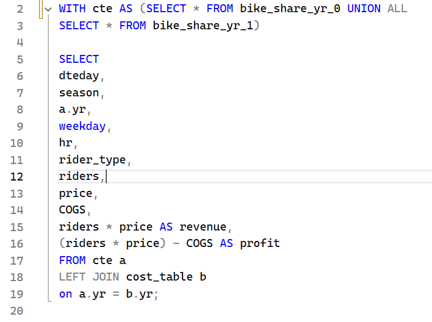
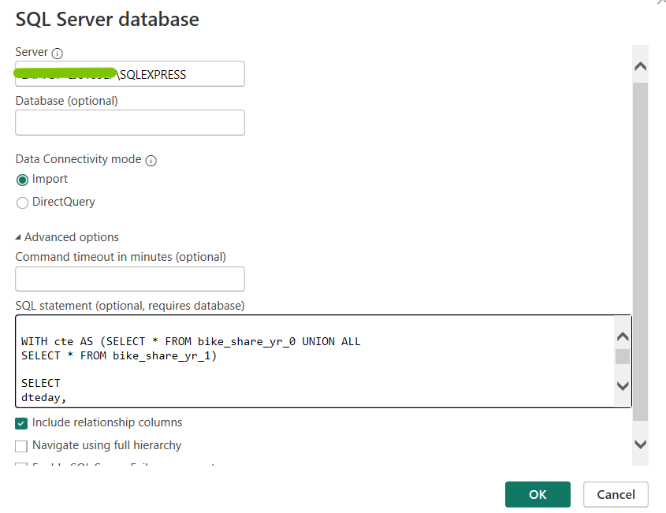

# End-to-End-Project-Data-Analysis-in-Toman-s-Bike-Share
These project was performed based on the YT Page Turorial by Absent Data that uses a fictional data set.
## Scenario
### An Email rRequest for Development of Toman Bike Share Dashboard###
Dear Data Analyst

We need your expertise to develop a dashboard for "Toman Bike Share" that display our key performance metrics for informed decision-making.

**Requirements:**
* Hour Revenue Analysis
* Profit and Revenue Trends
* Seasonal Revenue
* Rider Demographics

**Design and Aesthetics:** Use our company colors and ensure the dashboard is easy to navigate.
**Data Source:** Access to our databases will be provided. If no database, please create one.
**Deadline:** We need a preliminary version ASAP.
**Please provide an  estimated timeline for completion and recommendation on raising prices next year.**

Best Regards,
## Data Analysis Workflow ##
1. Create a Database
2. Develop SQL Queries
3. Connect PowerBI to DB
4. Answer the Analysis Question

## Key Insights Gained in this Project  ##
**1. Create a Database** - using SQL server, I created a database called "bike_data".
  
**2. Develop SQL Queries** - In this part, I removed unnecessary columns that were not needed for data analysis and created new columns for relevant data, such as revenue and profit.  

**3. Connect PowerBI to DB and Load Table**  - Connect the database to PowerBI. Click **Get Data*, and choose **SQL Server Database*. Then, input the required information of the database.  

**4. Use Relevant Visualization to Interpret Findings** - Using the Visualizations section of Power BI, I imported relevant charts to visualize trends in the datasets and customized their functionality and visual aesthetics to improve clarity and responsiveness.  

